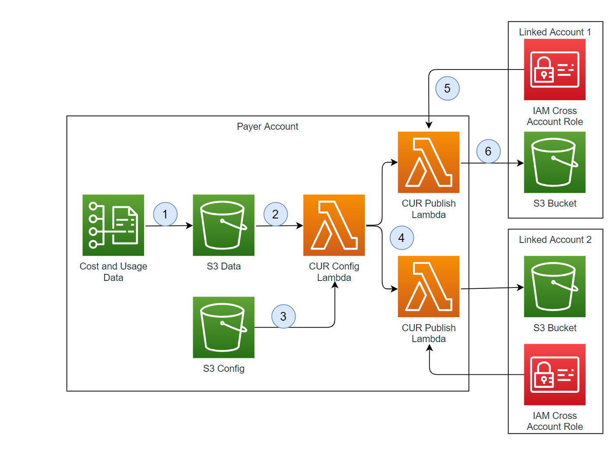

# AWSsolutions

## Introduction

Cost optimization is a continual process of refinement and improvement of a system over its entire lifecycle. Many customers configure 
Master/Payer Account for consolidated billing and consider cost data as restricted. This solution gives customer ability to publish account/s specific CUR data from Master/Payer account.

## Architecture

1. Configure Cost and Usage Reports data to be delivered to S3 in CSV format.
2. When CUR files are delivered, S3 events trigger CUR Config Lambda.
3. CUR Config Lambda reads CUR configuration file that has metadata of what data should be delivered to which accounts.
4. CUR Config Lambda triggers CUR Publish Lambda in async mode for each entry in CUR configuration file.
5. CUR Publish Lambda assumes cross account role.
6. CUR Publish Lambda filters and delivers data to linked account S3 bucket.

## Steps

1. Create cross account role in linked account
2. Create configuraiton entry in [configuration file](code/curpublish.conf) 
3. Configure CUR reports in Payer account.
4. Upload files from [code](code/) folder to S3. Deploy cloudformation stack using [template](code/cur.yaml) to deploy components.

	